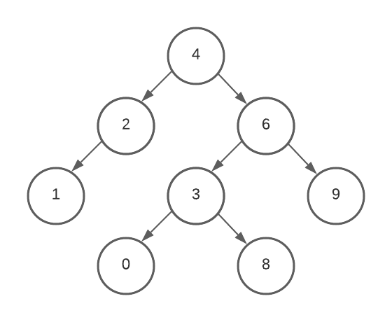

# Breadth-first Search

## Item ID
1563

## Claim
1: algorithms

## Target Skill Level
2

## Claim Behavior (evidence)
[Breadth-first Search](https://en.wikipedia.org/wiki/Breadth-first_search)

## Content Target
Searching

## Cognitive Model
Comprehend

## Item Type
Multiple choice

## Stem
An unknown search algorithm starts a search at the root of the following tree:

The lists below represent the order of the first three nodes visited.  Which list would indicate that the algorithm is a *breadth-first* search?

## Code Snippet (optional)

## Answer Key
4, 2, 6

## Distractors
### 1.
4, 2, 1

### 2.
4, 6, 3

### 3.
4, 6, 9

## Common errors, misconceptions, or irrelevant information:

# Triplebyte Review

## Language Review: (TB only)

## Bias and Fairness Review: (TB only)

## Content Review: (TB only)
