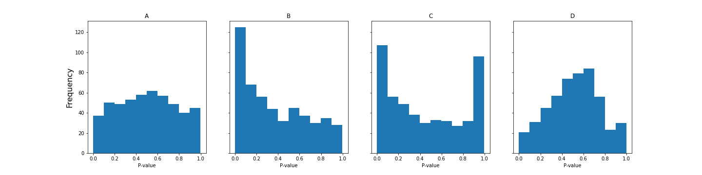

# Visualize AA

## Item ID
2022

## Claim
3

## Threshold Probabilities
[0.25, 0.4, 0.5, 0.6]

## Claim Behavior (evidence)
> If all null hypotheses are true, these p-values follow a uniform distribution, which corresponds to a flat-looking histogram.
> 
-- [p-value histograms: Inference and Diagnostics](https://www.ncbi.nlm.nih.gov/pmc/articles/PMC6164648/)

> [a uniform distribution] is what your p-values would look like if all your hypotheses were null.

-- [How to interpret a P-value histogram](http://varianceexplained.org/statistics/interpreting-pvalue-histogram/)

## Content Target
Visualize data patterns

## Cognitive Model
Comprehend

## Item Type
Multiple Choice

## Stem
In a normal A/B test, you randomly divide users into two groups that are treated differently, and measure a metric such as click rate for each group. Then you test the null hypothesis that the two groups have equal click rates. 

In an A/A test, both groups are treated equally. This is useful to test that your experimental setup is working correctly - any difference should be either due to chance or a bug. 

You run an A/A test 100 times and calculate a P-value each time, then plot the distribution of P-values in a histogram. Which of the following histograms would provide evidence that your system is functioning properly?

## Code Snippet (optional)

## Answer Key
A

## Distractors
### 1.
B

### 2.
C

### 3.
D

## Common errors, misconceptions, or irrelevant information:
If the system is functioning properly, then the null hypothesis is in fact true and the P-values should be uniformly distributed over 0-1.

Too many low P-values usually mean you are detecting a real difference and your groups are not actually identical. 

Other patterns often indicate calculation errors, data collection issues, or improper assumptions.

# Triplebyte Review

## Language Review: (TB only)

## Bias and Fairness Review: (TB only)

## Content Review: (TB only)
