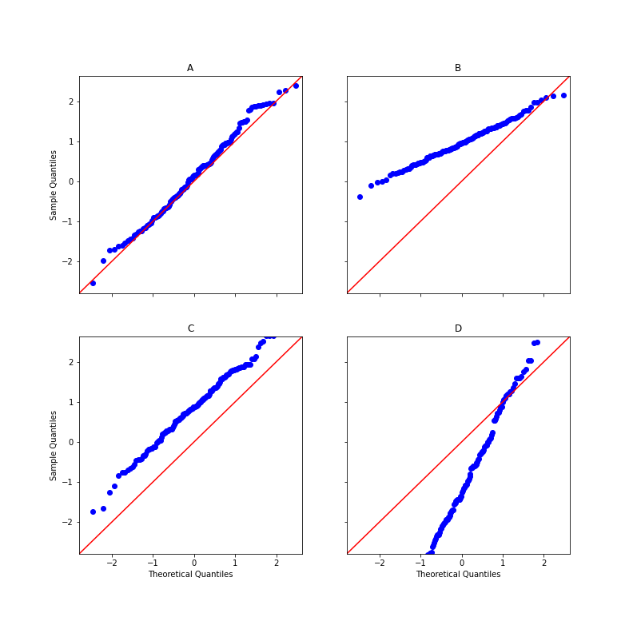

# Visualize QQ-plot Location-Scale

## Item ID
2024

## Claim
3

## Threshold Probabilities
[0.3, 0.4, 0.5, 0.55]

## Claim Behavior (evidence)
[Q-Q plot](https://en.wikipedia.org/wiki/Q%E2%80%93Q_plot)

The four distributions are:
- A: Standard normal
- B: Mean 1 std-dev 1/2
- C: Mean 1 std-dev 1
- D: Mean -1 std-dev 2

## Content Target
Visualize data patterns

## Cognitive Model
Comprehend

## Item Type
Multiple Choice

## Stem
A quantile-quantile or Q-Q plot compares two probability distributions by plotting their quantiles against each other. 

The following graph compares samples from four distributions to a standard normal distribution (mean of 0, standard deviation of 1). Which sample was drawn from a normal distribution with a mean of 1 and standard deviation of 1/2?

## Code Snippet (optional)

## Answer Key
B

## Distractors
### 1.
A

### 2.
C

### 3.
D

## Common errors, misconceptions, or irrelevant information:

# Triplebyte Review

## Language Review: (TB only)

## Bias and Fairness Review: (TB only)

## Content Review: (TB only)
