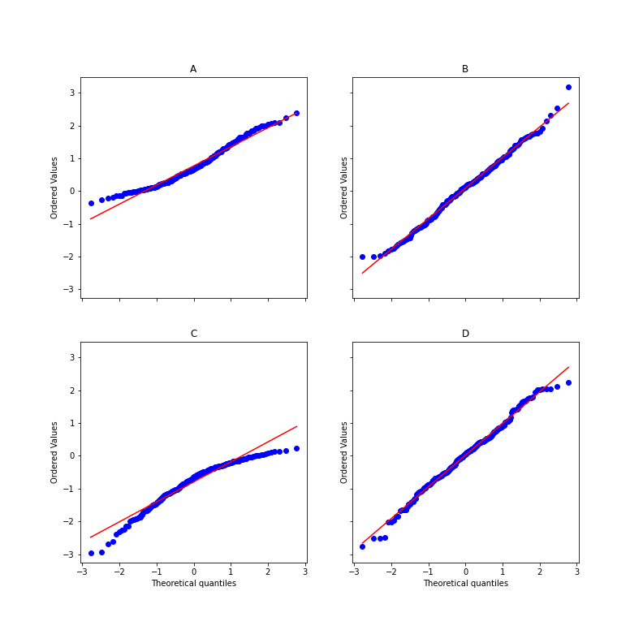

# Visualize QQ-plot Skew

## Item ID
2026

## Claim
3

## Threshold Probabilities
[0.25, 0.35, 0.45, 0.53]

## Claim Behavior (evidence)
[Q-Q plot](https://en.wikipedia.org/wiki/Q%E2%80%93Q_plot)

The computed skew values are: A=0.49 B=0.07 C=-0.93, D=-0.11.

## Content Target
Visualize data patterns

## Cognitive Model
Comprehend

## Item Type
Multiple Choice

## Stem
A quantile-quantile or Q-Q plot compares two probability distributions by plotting their quantiles against each other. The following graph compares samples from four different distributions to a normal distribution. Which sample has the greatest negative skew?

## Code Snippet (optional)

## Answer Key
C

## Distractors
### 1.
A

### 2.
B

### 3.
D

## Common errors, misconceptions, or irrelevant information:
Negative skew corresponds to a concave shape on the Q-Q plot.

# Triplebyte Review

## Language Review: (TB only)

## Bias and Fairness Review: (TB only)

## Content Review: (TB only)
