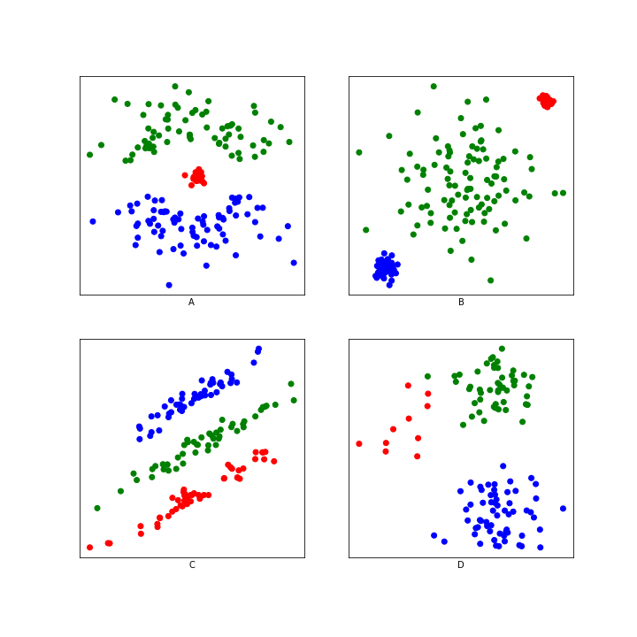
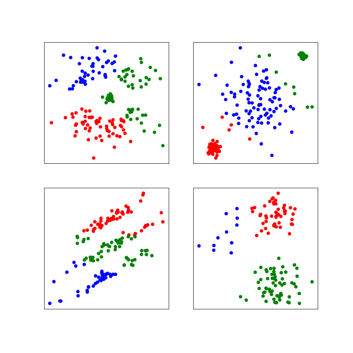

# Model Evaluation with K-Means

## Item ID
2027

## Claim
2

## Threshold Probabilities
[0.3, 0.4, 0.5, 0.6]

## Claim Behavior (evidence)
[K-means clustering](https://scikit-learn.org/stable/modules/clustering.html#k-means)

## Content Target
Model Evaluation

## Cognitive Model
Comprehend

## Item Type
Multiple Choice

## Stem
Consider each of the following datasets, where the colors indicate the true labels.

If we remove the labels and apply K-means clustering using a K of 3, which clustering output most closely resembles the true labels?

## Code Snippet (optional)

## Answer Key
D

## Distractors
### 1.
A

### 2.
B

### 3.
C

## Common errors, misconceptions, or irrelevant information:
A works poorly because the clusters are irregularly shaped
B works poorly because the clusters have unequal variance
C works poorly because the clusters are elongated
D is almost perfect, even though the clusters have different numbers of points.

# Triplebyte Review

## Language Review: (TB only)

## Bias and Fairness Review: (TB only)
I would worry that people with color vision deficiency may not be able to distinguish some of the color differences. It would help to use shape as well as a cue or draw a boundary around each cluster for anyone who doesn't see color typically.

## Content Review: (TB only)
I would suggest an edit to the stem as follows.

Each plot below shows a different data set. Different colors represent different true clusters.

Suppose we didn't know which data points belonged in which clusters and we used K-means clustering with K=3. In which dataset would K-means clustering do the best job of determining what color each point should be?
