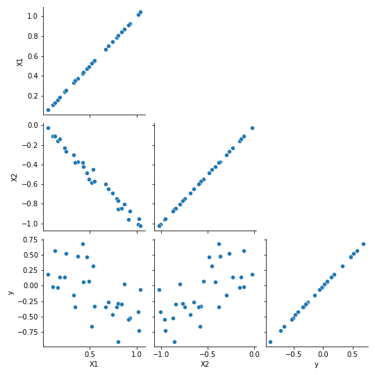

# Inspect Multicollinearity

## Item ID
2028

## Claim
1

## Threshold Probabilities
[0.15, 0.25, 0.35, 0.5]

## Claim Behavior (evidence)
> One of the features of multicollinearity is that the standard errors of the affected coefficients tend to be large.

-- [Multicollinearity](https://en.wikipedia.org/wiki/Multicollinearity)

## Content Target
Inspection

## Cognitive Model
Comprehend

## Item Type
Multiple Choice

## Stem
Consider the following dataset with features X1, X2, and the target variable y. 

Which of the following will result from performing linear regression using ordinary least squares on this data?

## Code Snippet (optional)

## Answer Key
Large coefficient standard errors

## Distractors
### 1.
Biased coefficient estimates

### 2.
An exception will be raised because the moment matrix is not invertible

### 3.
Ordinary least squares will fail to converge

## Common errors, misconceptions, or irrelevant information:
The only relevant information on the plot is the large (negative) correlation between X1 and X2.

# Triplebyte Review

## Language Review: (TB only)

## Bias and Fairness Review: (TB only)

## Content Review: (TB only)
To be doubly clear, I would add to the end of the stem: "Assume that y is to be predicted, using linear regression, from X1 and X2."
