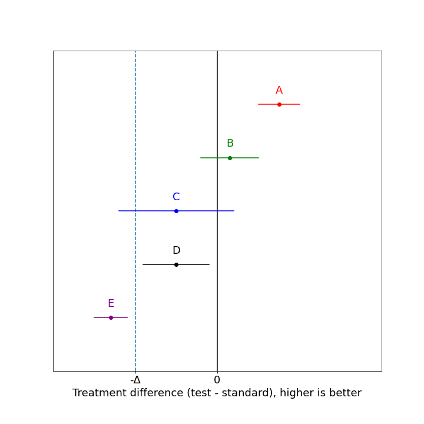

# Evaluation Confidence Interval Noninferiority

## Item ID
2045

## Claim
3

## Threshold Probabilities
[0.3, 0.37, 0.44, 0.51]

## Claim Behavior (evidence)
> A non-inferiority trial can have five possible types of outcomes as depicted in Figure 2. The two vertical lines indicate zero and -Δ. Each horizontal line represents a CI, with the estimated treatment effect denoted by the dot in the center. The CI at the top of the figure sits wholly above zero; a trial with this outcome would conclude that the new treatment is superior and hence, also non-inferior, to the control. The next interval, which spans zero but lies wholly above -Δ, represents a trial that has shown non-inferiority, but not superiority. The third interval, which straddles both zero and -Δ, represents a trial that has shown neither non-inferiority nor superiority. The fourth CI illustrates the case discussed above; tucked between the two vertical lines, it shows both non-inferiority (because it lies wholly above the line for -Δ) and inferiority (because it also lies wholly below zero). The final CI on the bottom of the figure shows inferiority and does not show non-inferiority.

-- [Through the looking glass: understanding non-inferiority](https://trialsjournal.biomedcentral.com/articles/10.1186/1745-6215-12-106)

## Content Target
Evaluation of Business Value

## Cognitive Model
Comprehend

## Item Type
Multiple Choice

## Stem
You have been asked to perform a "non-inferiority" trial on a new generic medicine. A non-inferiority trial is a type of randomized controlled trial where the null hypothesis is that the treatment is worse than the standard by at least a predefined amount Δ. 

Rejecting the null hypothesis at the 90% significance level means that the trial has demonstrated "non-inferiority". In other words, the trial provides good evidence the new drug is not too much worse (if at all) than the standard.

Which of the following 90% confidence intervals would be sufficient to declare non-inferiority? 

## Code Snippet (optional)

## Answer Key
A, B, and D

## Distractors
### 1.
A and B

### 2.
A, B, C, and D

### 3.
A, C, and D

## Common errors, misconceptions, or irrelevant information:
This is a commonly used study design that is counterintuitive because the null hypothesis is not the usual "no difference between groups", and a specific technical meaning of non-inferiority. Definitions are provided so no knowledge of medicine is required.

C does not demonstrate non-inferiority because the confidence interval overlaps -Δ. 
D does demonstrate non-inferiority because the confidence interval does NOT overlap -Δ. The interpretation is that the drug is probably worse than the standard, but not too much worse to use it.

# Triplebyte Review

## Language Review: (TB only)

## Bias and Fairness Review: (TB only)

## Content Review: (TB only)
