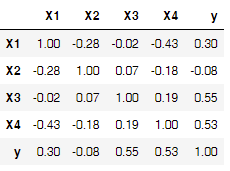

# Feature Selection Omitted Variable

## Item ID
2047

## Claim
1

## Threshold Probabilities
[0.15, 0.25, 0.35, 0.45]

## Claim Behavior (evidence)
> Two conditions must hold true for omitted-variable bias to exist in linear regression:
> the omitted variable must be a determinant of the dependent variable (i.e., its true regression coefficient must not be zero); 
> and the omitted variable must be correlated with an independent variable specified in the regression (i.e., cov(z,x) must not equal zero).

> In ordinary least squares, the relevant assumption of the classical linear regression model is that the error term is uncorrelated with the regressors.
> The presence of omitted-variable bias violates this particular assumption. The violation causes the OLS estimator to be biased and inconsistent.

-- [Omitted-variable bias](https://en.wikipedia.org/wiki/Omitted-variable_bias)

## Content Target
Feature Selection

## Cognitive Model
Comprehend

## Item Type
Multiple Choice

## Stem
Consider a dataset with the following correlations between features X1, X2, X3, X4, and the target variable y.

Feature X4 is difficult and expensive to measure, so you decide to omit it. With the remaining three features, you use ordinary least squares to predict the target y. Your model's estimate of the regression coefficients is:

## Code Snippet (optional)

## Answer Key
Biased and inconsistent

## Distractors
### 1.
Unbiased and inconsistent

### 2.
Unbiased and consistent

### 3.
Biased and consistent

## Common errors, misconceptions, or irrelevant information:

# Triplebyte Review

## Language Review: (TB only)

## Bias and Fairness Review: (TB only)

## Content Review: (TB only)
I'm afraid some test takers may wonder whether the correlations in the table are significantly different from zero. It might help to add to the stem "Assume the sample size is large enough that all correlations in the table are significantly different from zero."
