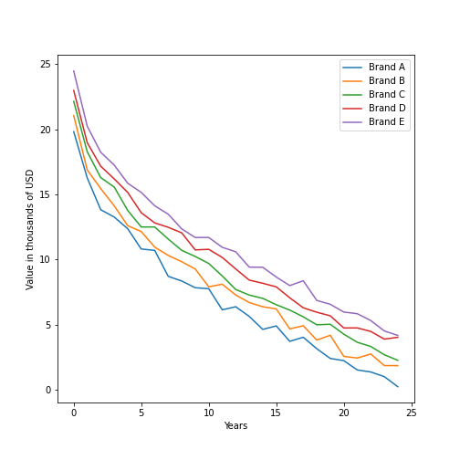

# Feature Engineering Nonlinear

## Item ID
2049

## Claim
1

## Threshold Probabilities
[0.24, 0.33, 0.40, 0.5]

## Claim Behavior (evidence)
> The logarithm and square root transformations are commonly used for positive data

[Data Transformation](https://en.wikipedia.org/wiki/Data_transformation_(statistics))

## Content Target
Feature Engineering

## Cognitive Model
Comprehend

## Item Type
Multiple Choice

## Stem
You are modelling the depreciation (decrease in value) of vehicles over time. 

For several similar brands of consumer vehicle, you plot the average value versus the number of years since the car was purchased new and observe the non-linear relationship shown below.

Which of the following transformations would be most appropriate to prepare the years feature for a linear model? 

## Code Snippet (optional)

## Answer Key
Use the square root of years

## Distractors
### 1.
Use weeks by multiplying years * 52

### 2.
Use categorical features for "0-5 years old", "5-10 years old", etc.

### 3.
Use the natural logarithm of years

## Common errors, misconceptions, or irrelevant information:
Weeks vs years does nothing since it is a linear transformation.
Categorical has the problem of setting an appropriate bin width and handling sparsely populated bins.
The logarithm would be appropriate if the data was exponential, but visually the decline is not that steep.

# Triplebyte Review

## Language Review: (TB only)

## Bias and Fairness Review: (TB only)

## Content Review: (TB only)
I'm not sure that the average person will realize that logarithm is inferior to square root in this case, and in some domains (e.g., epidemiology) binning would be a solution chosen by data scientists. I would suggest the following:
Correct Response: Replace each X value in years with its square root
1: Fine
2: Replace each X value in years with the square of that X value in years
3: First take the square root of each X value in years, then take the logarithm of that
