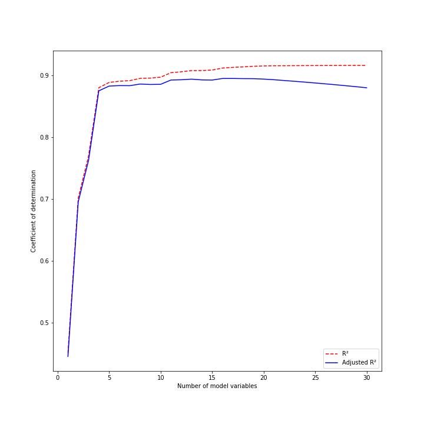

# Evaluation Adjusted R2

## Item ID
2051

## Claim
3

## Threshold Probabilities
[0.25, 0.35, 0.43, 0.5]

## Claim Behavior (evidence)
> If a set of explanatory variables with a predetermined hierarchy of importance are introduced into a regression one at a time, with the adjusted R2 computed each time, the level at which adjusted R2 reaches a maximum, and decreases afterward, would be the regression with the ideal combination of having the best fit without excess/unnecessary terms.

-- [Adjusted R2](https://en.wikipedia.org/wiki/Coefficient_of_determination#Adjusted_R2)

## Content Target
Evaluation of Business Value

## Cognitive Model
Comprehend

## Item Type
Multiple Choice

## Stem
Consider a regression analysis where you already understand the approximate importance of each independent variable. 

You create a series of models starting with only the most important variable and adding variables in decreasing order of importance. For each model, you compute the R² value (coefficient of determination) and also the adjusted R². 

Based on the following graph, how many model variables would provide the best predictive power without including any unnecessary variables?

## Code Snippet (optional)

## Answer Key
17

## Distractors
### 1.
4

### 2.
30

### 3.
10

## Common errors, misconceptions, or irrelevant information:

# Triplebyte Review

## Language Review: (TB only)

## Bias and Fairness Review: (TB only)

## Content Review: (TB only)
