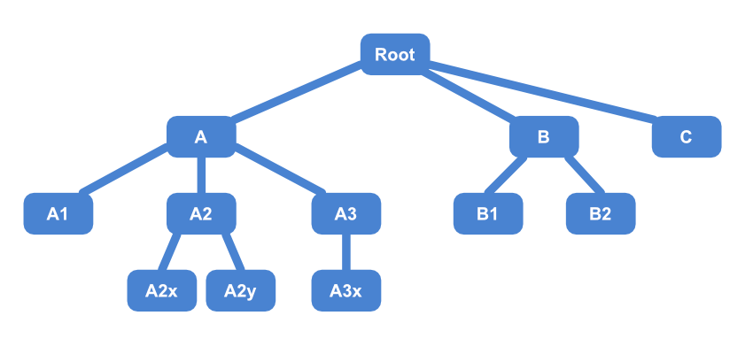

# CS: Tree Depth First Search

## Item ID
cs-tree-depth

## Claim
Academic CS

## Claim Behavior (evidence)

* [Depth First Search](https://en.wikipedia.org/wiki/Depth-first_search#Example) - Wikipedia

## Content Target
Depth First Search

## Cognitive Model
Comprehend


## Item Type
Multiple Choice

## Stem

There are a few ways of traversing a tree of data.  

Using **depth-first search** to traverse this tree will visit the nodes in which order?


## Code Snippet (optional)

```
* Root
    * A
        * A1
        * A2
            * A2x
            * A2y
        * A3
            * A3x
    * B
        * B1
        * B2
    * C
```

## Answer Key

```
Root, A, A1, A2, A2x, A2y, A3, A3x, B, B1, B2, C
```

## Distractors

### 1.
```
Root, A, B, C, A1, A2, A3, B1, B2, A2x, A2y, A3x
```

### 2.
```
A2x, A2y, A3x, A1, A2, A3, B1, B2, A, B, C, Root
```

### 3.
```
Root, A, A1, B, B1, C, A2, A2x, A3, A3x, B2, A2y
```


## Common errors, misconceptions, or irrelevant information (optional):

* Depth first and breadth first search both start from and visit the root node first.  
* Depth first search prefers to go deeper down the tree, before visiting all the next child node.  
* Breadth first search visits all the children before proceeding to the grandchildren nodes.

# Triplebyte Review


## Language Review: (TB only)


## Bias and Fairness Review: (TB only)


## Content Review: (TB only)
