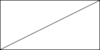
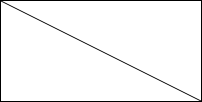

# Lines on Canvas

## Item ID
2143

## Claim
Claim 1: responsive_ui

## Claim Behavior (evidence)
[HTML Canvas Graphics](https://www.w3schools.com/html/html5_canvas.asp) - w3c

## Content Target
HTML

## Cognitive Model
Recall

## Item Type
Multiple Choice

## Stem
What is produced by the following HTML and Javascript?

## Code Snippet (optional)
```html
<canvas id="graphic" width="200" height="100" style="border:1px solid #000000;"></canvas>

<script>
    const context = document.getElementById('graphic').getContext("2d")
    context.moveTo(0, 100)
    context.lineTo(200, 0)
    context.stroke()
</script>
```

## Answer Key


## Distractors
### 1.


### 2.


### 3.


## Common errors, misconceptions, or irrelevant information:

# Triplebyte Review

## Language Review: (TB only)

## Bias and Fairness Review: (TB only)

## Content Review: (TB only)
