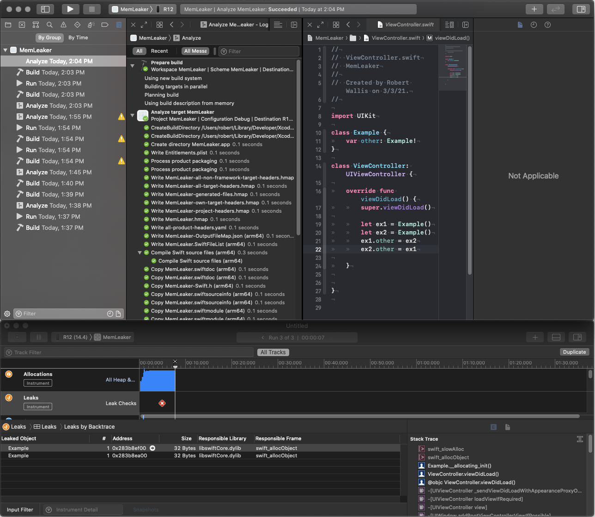

# iOS: Mem Leaker


## Item ID
ios-4-mem-leaker


## Claim
-   Claim/PI 4: The candidate is well-versed in native iOS development, along with both the underlying theory and practical application of Objective-C/Swift and of the iOS platform itself. They understand iOS data persistence methods, memory management, and performance profiling and troubleshooting, and they are comfortable using a range of UI development tools to create a responsive UI. They may not know all the details of advanced performance optimizations, but can clearly articulate tradeoffs between different libraries and tools. They display the ability to translate theoretical knowledge into practical solutions that are close to optimal.


## Claim Behavior (evidence)

> The Instruments application can be used to find leaks in both OS X and iPhone applications. To find leaks, create a new document template in Instruments and add the Leaks instrument to it.
https://developer.apple.com/library/archive/documentation/Performance/Conceptual/ManagingMemory/Articles/FindingLeaks.html

In the following screenshot, the newest Analyze (2:04pm) has no issues
with the code, it should show a yellow triangle like at 1:55pm.
However Instruments (the "untitled" window below it) detects a leak in the Example class using the Leaks tool.


## Content Target
* debugging
* memory management
* Instruments


## Cognitive Model
Comprehension


## Item Type
Multiple Choice


## Stem
You're using XCode 12.4.
What tool can you use to find the bugs in the following iOS app?


## Code Snippet (optional)
```swift
class Example {
	var other: Example!
}

class ViewController: UIViewController {

	override func viewDidLoad() {
		super.viewDidLoad()

		let ex1 = Example()
		let ex2 = Example()
		ex1.other = ex2
		ex2.other = ex1
	}
}
```


## Answer Key
Product > Profile, Instruments Leaks


## Distractors
### 1.
Product > Analyze, Static Code Analysis


### 2.
Product > Profile, Instruments Allocations


### 3.
Product > Run, Unexpectedly found nil while implicitly unwrapping an Optional value


## Common errors, misconceptions, or irrelevant information:
1. Static Code Analysis should find "Memory management flaws, such as leaking allocated memory" unfortunately for this self referencing leak it does not find any issues.
2. Allocations does show the number of allocations, or amount of memory used, but it doesn't easily display the small leak here.

# Triplebyte Review


## Language Review: (TB only)


## Bias and Fairness Review: (TB only)


## Content Review: (TB only)

