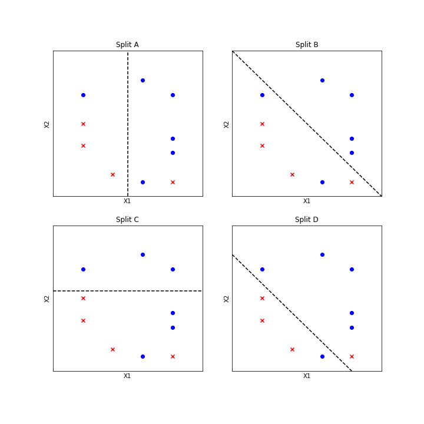

#


## Item ID
2190

## Claim

4

## Claim Behavior (evidence)

[Gini Impurity](https://en.wikipedia.org/wiki/Decision_tree_learning#Gini_impurity)

## Content Target

Machine Learning Models

## Cognitive Model

Comprehend

## Item Type

Multiple Choice

## Stem

Consider a binary classification dataset with two numerical features `X1` and `X2`.

You train a decision tree classifier using Gini impurity for choosing split points. 

If `p(i)` is the probability of class i in a dataset, the Gini impurity of a set of points is defined as the sum over each class i of `p(i) * (1 - p(i))`. 

The best split then minimizes the sum of impurities, weighted by the size of each branch.

Given the dataset below, which of the following would be the best first split of the decision tree?



## Code Snippet (optional)


## Answer Key

Split A

## Distractors
### 1.

Split B

### 2.

Split C

### 3.

Split D


## Common errors, misconceptions, or irrelevant information:

The standard decision tree algorithm only considers one feature at a time, so Splits B and D which are on a function of two features would never be considered.

Note that for two classes `1 - p(0) = p(1)` and `1 - p(1) = p(0)` so the impurity of a branch reduces to `2 * p(0) * p(1)`.

The calculation between A and C looks messy at first but most terms cancel:

```
A <> C

4/10 * 2 * 3/4 * 1/4 + 6/10 * 2 * 5/6 * 1/6 <> 0 + 7/10 * 2 * 4/7 * 3/7

Cancel 2/10 from both sides and cancel tops and bottoms:

3/4 + 5/6 <> 12/7
1.58 < 1.71
```


# Triplebyte Review


## Language Review: (TB only)


## Bias and Fairness Review: (TB only)


## Content Review: (TB only)

