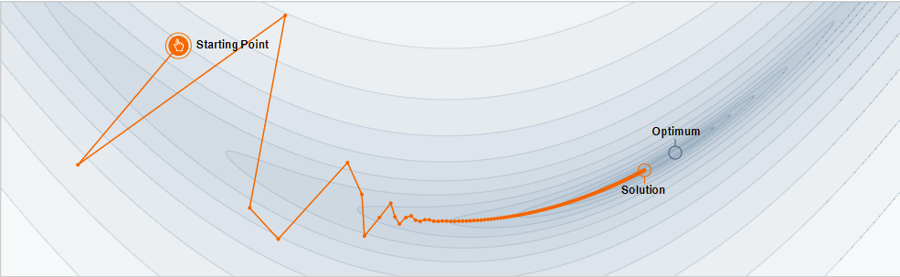

#

## Item ID
2191

## Claim

4

## Claim Behavior (evidence)

> For a step-size small enough, gradient descent makes a monotonic improvement at every iteration. 

> The added inertia acts both as a smoother and an accelerator, dampening oscillations and causing us to barrel through narrow valleys, small humps and local minima.

-- [Why Momentum Really Works](https://distill.pub/2017/momentum/)

## Content Target

Machine Learning Models

## Cognitive Model

Comprehend

## Item Type

Multiple Choice

## Stem

Consider the following plot of an objective function optimized using stochastic gradient descent with momentum.

The optimizer has two parameters, learning rate `α` and momentum rate `β`, where `β = 0` corresponds to no momentum. 

Which of the following adjustments would allow the optimum to be reached in the same number of iterations?

## Code Snippet (optional)

## Answer Key

Decrease learning rate and increase momentum rate

## Distractors
### 1.

Decrease learning rate and decrease momentum rate

### 2.

Increase learning rate and increase momentum rate

### 3.

Increase learning rate and decrease momentum rate

## Common errors, misconceptions, or irrelevant information:

Plot corresponds to α = 0.0044, β = 0.50.

The large oscillations at the beginning where the objective function actually increases indicate that α is too big.

The slow progress in the valley near the objective indicates that β is too small. 

# Triplebyte Review

## Language Review: (TB only)

## Bias and Fairness Review: (TB only)

## Content Review: (TB only)

