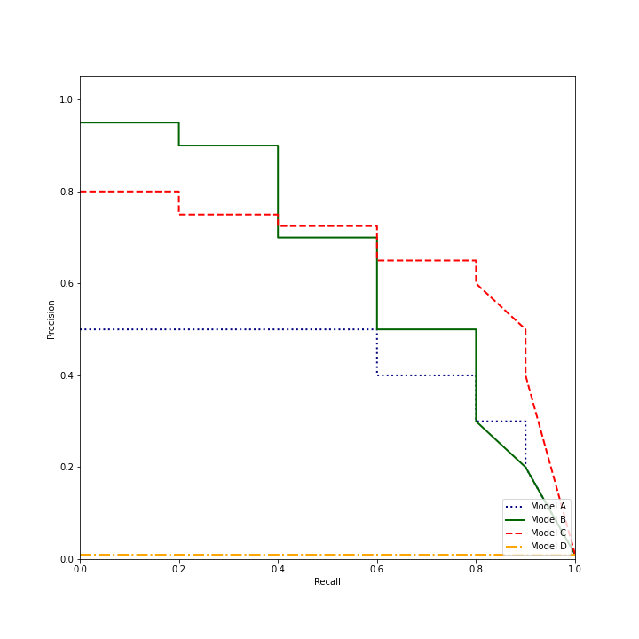

#

## Item ID
2203

## Claim

7

## Claim Behavior (evidence)

[Introduction to the precision-recall plot](https://classeval.wordpress.com/introduction/introduction-to-the-precision-recall-plot/)

[The Relationship BEtween Precision-Recall and ROC Curves](http://pages.cs.wisc.edu/~jdavis/davisgoadrichcamera2.pdf)

## Content Target

Performance Metrics

## Cognitive Model

Comprehend

## Item Type

Multiple Choice

## Stem

You have trained and deployed four different models to detect fraudulent credit card transactions, which occur only about 1% of the time. To compare your models, you plot the following precision-recall curves. 

Which model should be selected if the most important consideration is a high positive predictive value, meaning that transactions flagged as fraudulent are highly likely to be in fact fraudulent? 

## Code Snippet (optional)

## Answer Key

Model B

## Distractors
### 1.

Model C

### 2.

Model A

### 3.

Model D

## Common errors, misconceptions, or irrelevant information:

Positive predictive value is another term for precision. Therefore, the correct answer has a higher precision at the cost of lower recall (more truly fraudulent transactions are not caught). 

Model C can maintain better precision at high recall, which would be useful if we wanted to flag a lot of the fraud cases for further investigation.

Model D is a baseline that always predicts fraud, so it has a fixed 1% precision. 

# Triplebyte Review

## Language Review: (TB only)

## Bias and Fairness Review: (TB only)

## Content Review: (TB only)

