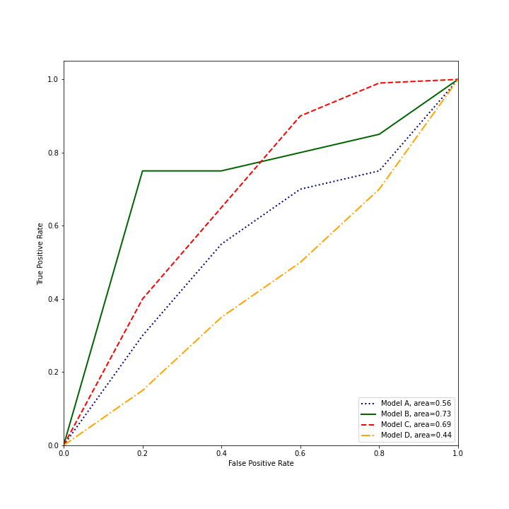

#

## Item ID
2209

## Claim

7

## Claim Behavior (evidence)

[Receiver Operating Characteristic](https://scikit-learn.org/stable/auto_examples/model_selection/plot_roc.html)

## Content Target

Performance Metrics

## Cognitive Model

Comprehend

## Item Type

Multiple Choice

## Stem

You have trained and deployed four different models to screen for a certain disease. During a trial period, your models made predictions that were compared to expert evaluations, resulting in the following receiver operating characteristic (ROC) curves:

Which model should be selected when the most important consideration is a low rate of false negatives? 

## Code Snippet (optional)

## Answer Key

Model C

## Distractors
### 1.

Model A

### 2.

Model B

### 3.

Model D

## Common errors, misconceptions, or irrelevant information:

While Model B has a slightly higher AUROC overall and would likely be preferred if low false positives were most important, the false negative rate is 1 - true positive rate and Model C achieves the desired highest true positive rate.

# Triplebyte Review

## Language Review: (TB only)

## Bias and Fairness Review: (TB only)

## Content Review: (TB only)

