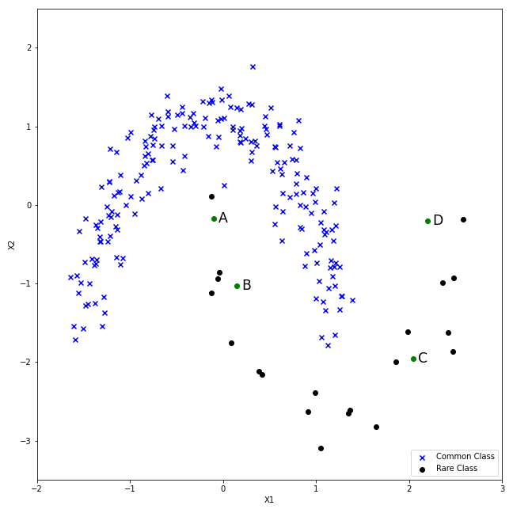

#

## Item ID
2212

## Claim

1

## Claim Behavior (evidence)

> To then oversample, take a sample from the dataset, and consider its k nearest neighbors (in feature space). To create a synthetic data point, take the vector between one of those k neighbors, and the current data point. Multiply this vector by a random number x which lies between 0, and 1. Add this to the current data point to create the new, synthetic data point.

-- [Oversampling_and_undersampling_in_data_analysis](https://en.wikipedia.org/wiki/Oversampling_and_undersampling_in_data_analysis#SMOTE)

> SMOTE first selects a minority class instance a at random and finds its k nearest minority class neighbors. The synthetic instance is then created by choosing one of the k nearest neighbors b at random and connecting a and b to form a line segment in the feature space. The synthetic instances are generated as a convex combination of the two chosen instances a and b.

-- [SMOTE for Imbalanced Classification with Python](https://machinelearningmastery.com/smote-oversampling-for-imbalanced-classification/)

## Content Target

Data Manipulation

## Cognitive Model

Comprehend

## Item Type

Multiple Choice

## Stem

The Synthetic Minority Oversampling Technique (SMOTE) is a common form of data augmentation used for imbalanced classification problems (one class is more rare than the other). SMOTE creates new data in the rare class as a convex combination of an existing member of the rare class and one of its k nearest rare neighbours.

Which of the following data points could be generated using SMOTE with k = 2?

## Code Snippet (optional)

## Answer Key

A and C

## Distractors
### 1.

A and B

### 2.

B and C

### 3.

B and D

## Common errors, misconceptions, or irrelevant information:

Geometrically, new points must be on the line between a point and one of its 2 closest neighbours.

B is on such a line but not between two close neighbors. D is not on the line at all.

# Triplebyte Review

## Language Review: (TB only)

## Bias and Fairness Review: (TB only)

## Content Review: (TB only)

