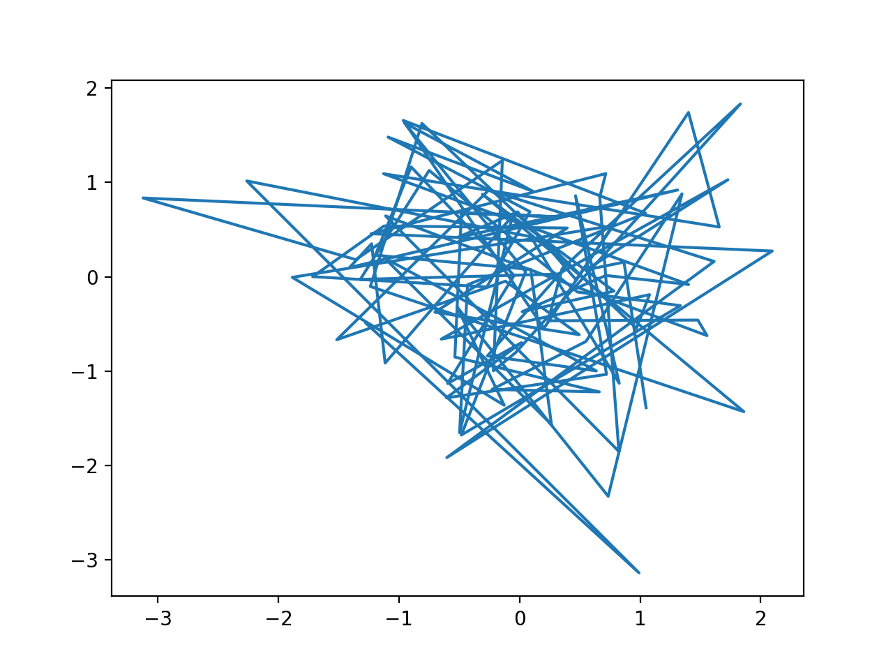
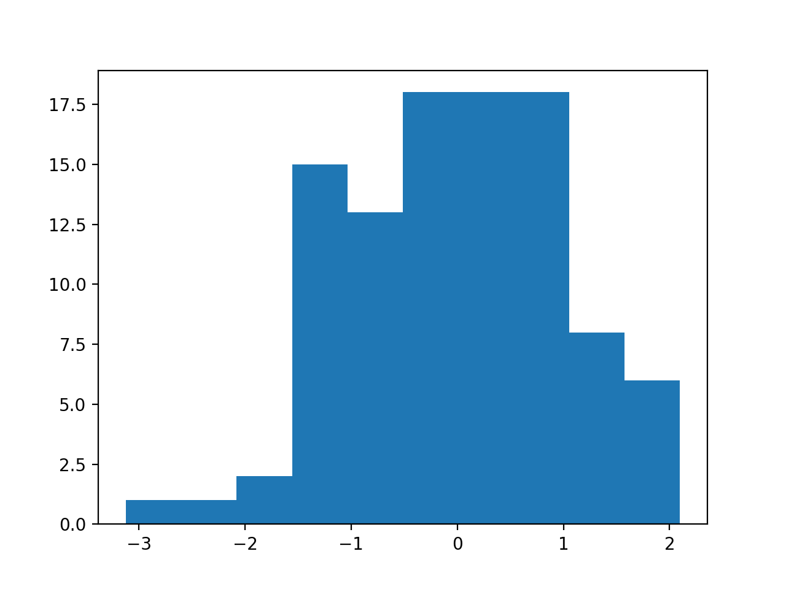
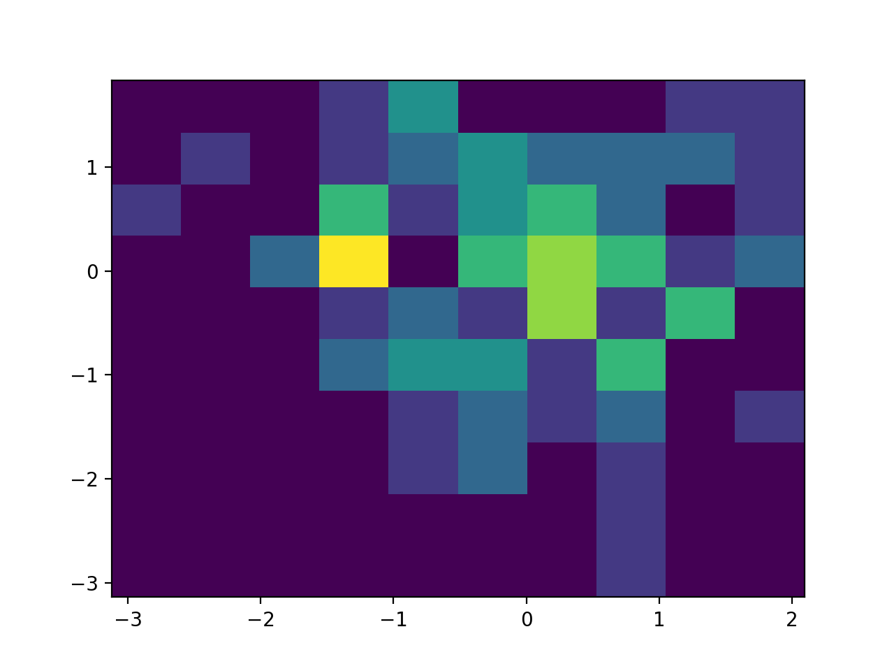
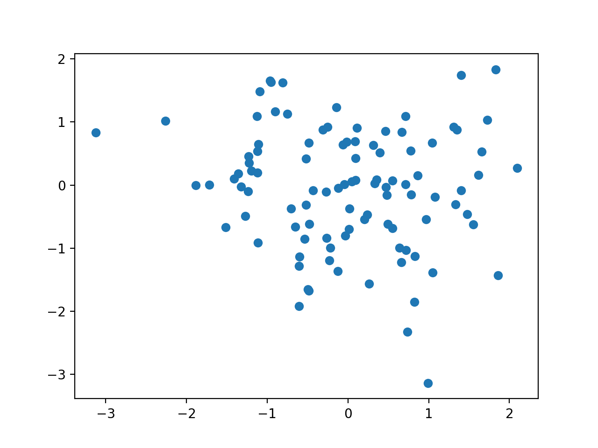

# Python Libraries matplotlib

## Item ID
python-libraries-matplotlib

## Claim
5. Familiarity with major frameworks or libraries associated with the language’s major usages.

## Claim Behavior (evidence)
>     import matplotlib.pyplot as plt
>     import numpy as np
>     
>     np.random.seed(19680801)
>     data = np.random.randn(2, 100)
>     
>     fig, axs = plt.subplots(2, 2, figsize=(5, 5))
>     axs[0, 0].hist(data[0])
>     axs[1, 0].scatter(data[0], data[1])
>     axs[0, 1].plot(data[0], data[1])
>     axs[1, 1].hist2d(data[0], data[1])
>     
>     plt.show()
> -- [matplotlib - sample plots - Subplot example](https://matplotlib.org/tutorials/introductory/sample_plots.html#subplot-example)

## Content Target
matplotlib

## Cognitive Model
Comprehension

## Item Type
* Multiple Choice
* possible match left and right

## Stem
There are 4 plots below that were generated with `matplotlib`.
Which plots correspond to the following code?

Figure A:


Figure B:


Figure C:


Figure D:


## Code Snippet (optional)

```python
# Snippet 1
pyplot.hist(data[0])
pyplot.show()

# Snippet 2
pyplot.scatter(data[0], data[1])
pyplot.show()

# Snippet 3
pyplot.plot(data[0], data[1])
pyplot.show()

# Snippet 4
pyplot.hist2d(data[0], data[1])
pyplot.show()
```

## Answer Key
* Snippet 1 = Figure B
* Snippet 2 = Figure D
* Snippet 3 = Figure A
* Snippet 4 = Figure C

## Distractors

### 1.
* Snippet 1 = Figure B
* Snippet 2 = Figure A
* Snippet 3 = Figure D
* Snippet 4 = Figure C

### 2.
* Snippet 1 = Figure C
* Snippet 2 = Figure A
* Snippet 3 = Figure B
* Snippet 4 = Figure D

### 3.
* Snippet 1 = Figure C
* Snippet 2 = Figure D
* Snippet 3 = Figure B
* Snippet 4 = Figure A


## Common errors, misconceptions, or irrelevant information:


# Triplebyte Review


## Language Review: (TB only)


## Bias and Fairness Review: (TB only)


## Content Review: (TB only)

