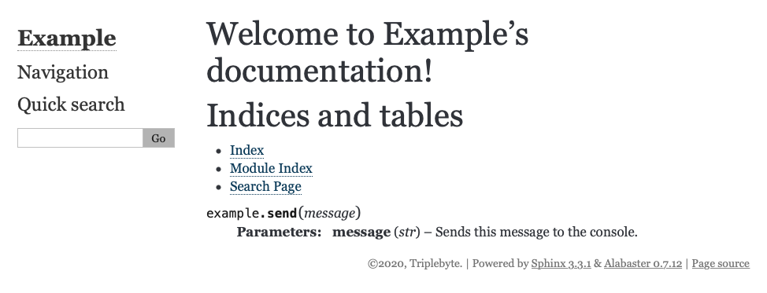

# Python Libraries sphinx

## Item ID
python-libraries-sphinx

## Claim
5. Familiarity with major frameworks or libraries associated with the language’s major usages.

## Claim Behavior (evidence)
https://www.sphinx-doc.org/en/master/usage/restructuredtext/domains.html#info-field-lists


    % make html
    Running Sphinx v3.3.1
    loading pickled environment... done
    building [mo]: targets for 0 po files that are out of date
    building [html]: targets for 0 source files that are out of date
    updating environment: 0 added, 0 changed, 0 removed
    looking for now-outdated files... none found
    no targets are out of date.
    build succeeded.
    
    The HTML pages are in build/html.


Note `send_1`, `send_2`, and `send_3` are not documented.

-- [source/example.py](source/example.py)

## Content Target
sphinx function doc

## Cognitive Model
Recall

## Item Type
Multiple Choice

## Stem
How do you use sphinx's autodoc extension to document the `message` field as a `str` type for the function below?

## Code Snippet (optional)


## Answer Key
```python
def send(message):
    """
    :param str message: Sends this message to the console.
    """
    print(message)
```


## Distractors
### 1.
```python
@param('message', 'Sends this message to the console.', 'str')
def send(message):
    print(message)
```

### 2.
```python
# @message str: Sends this message to the console.
def send(message):
    print(message)
```

### 3.
```python
@doc(param='message', description='Sends this message to the console.', type='str')
def send(message):
    print(message)
```


## Common errors, misconceptions, or irrelevant information:

By default, sphinx won't autodocument a function, you have to add the `'sphinx.ext.autodoc'` extension and the following to a file:
```rst
.. automodule:: example
   :members:
```

But after doing this, sphinx autodoc doesn't use comments above a function to document it, and instead relies on docstrings written with specific tags.

# Triplebyte Review


## Language Review: (TB only)


## Bias and Fairness Review: (TB only)


## Content Review: (TB only)

