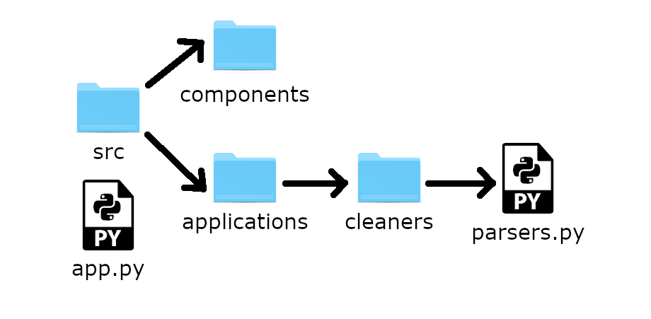

# Python Features import

## Item ID
1316

## Claim
Claim 3

## Claim Behavior (evidence)

[Source](https://docs.python.org/3/tutorial/modules.html#packages). Import a class from a project into another file in the project.

## Content Target
`import-module`

## Cognitive Model 

Recall

## Item Type
Multiple choice

## Stem
Say we have the following folder structure for our project:



And we would like to import a class named `ParseString` from the `parsers.py` file in `app.py`. Which is the correct syntax to import the class?

## Code Snippet (optional)

## Answer Key

```python
from src.applications.cleaners.parsers import ParseString
```

## Distractors 

### 1.
```python
from parsers import ParseString
```

### 2.
```python
from src.applications.cleaners.parsers.py import ParseString
```

### 3.
```python
src.applications.cleaners.parsers import ParseString
```

## Common errors, misconceptions, or irrelevant information (optional)

## Content Review

- Accuracy: ✅
    - ✅ did a reverse image search on Google, Bing, and TinEye, no matches
    - ? using a folder named `src` as a module is a little weird, but it functions
- Alignment: ✅

* fixed formatting to ` ```python `
