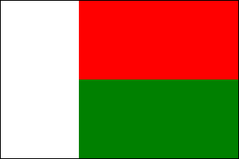

# React Native Layout with Flexbox

## Item ID
1931

## Claim
Claim ?

## Threshold Probabilities
[0.25, 0.41, 0.57, 0.75]

## Claim Behavior (evidence)
- [Layout with Flexbox](https://reactnative.dev/docs/flexbox) - reactnative.dev

## Content Target
React Native
Layout

## Cognitive Model
* Use

## Item Type
Multiple Choice

## Stem
This React Native component will use Flexbox to display the flag of Madagascar.  Choose the correct styles to complete this component.



## Code Snippet
```jsx
const styles = StyleSheet.create({
    /* ### ADD STYLES HERE ### */

    border: { 
        height: '200px', 
        width: '300px', 
        borderColor: 'black', 
        borderWidth: '1px' 
    },
    whiteBar: {
        backgroundColor: 'white',
        width: '33%'
    },
    redBar: {
        backgroundColor: 'red',
        height: '50%'
    },
    greenBar: {
        backgroundColor: 'green',
        height: '50%'
    }
})

function MadagascarFlag() {
    return (
        <View style={styles.border}>
            <View style={styles.flag}>
                <View style={styles.whiteBar}></View>
                <View style={styles.right}>
                    <View style={styles.redBar}></View>
                    <View style={styles.greenBar}></View>
                </View>
            </View>
        </View>
    )
}
```

## Answer Key
```jsx
    flag: {
        flex: 1,
        flexDirection: 'row'
    },
    right: {
        flex: 1,
        flexDirection: 'column'
    },
```

## Distractors
### 1.
```jsx
    flag: {
        flex: 1,
        flexDirection: 'column'
    },
    right: {
        flex: 2,
        flexDirection: 'row'
    },
```

### 2.
```jsx
    flag: {
        flex: 2,
        flexDirection: 'column'
    },
    right: {
        flex: 1,
        flexDirection: 'row'
    },
```

### 3.
```jsx
    flag: {
        flexDirection: 'row',
    },
    right: {
        flexDirection: 'column'
    },
```


## Common errors, misconceptions, or irrelevant information (optional):

* `flexDirection` can be a little counter-intuitive.  It refers to the direction that child components aggregate.  Someone might want to build conceptual rows but, as far as flexbox is concerned, those rows are stacked in a column.  So, the appropriate `flexDirection` is `column`.
* The value of the `flex` property doesn't matter in this case, because of the way the views are nested.  This example has two distinct, nested flexboxes.
* Even though the value of `flex` doesn't matter in this case, *some* `flex` value must be present.

# Triplebyte Review


## Language Review: (TB only)


## Bias and Fairness Review: (TB only)


## Content Review: (TB only)

