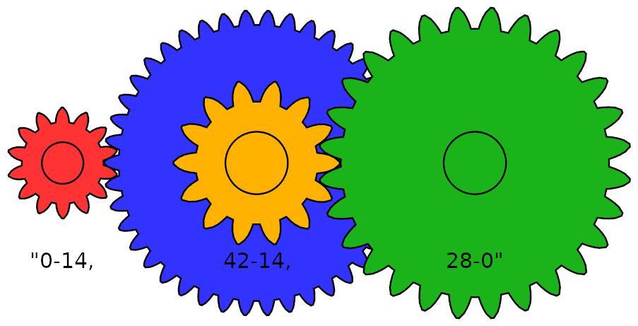

## Item ID
timed-coding-geometry-gears

## Claim
Claim 3

## Claim Behavior (evidence)

## Content Target


## Cognitive Model
Use

## Item Type
Timed Coding Evaluation

## Item Title (Seen by Candidate)
Gear Train

## Category
Debugging

## Stem
A "gear train" is a set of gears in which each gear engages the next.  The first and last gears are simple, with only one set of teeth.  Each gear in between is a compound gear, with two sets of teeth.  A compound gear is essentially just two simple gears that are fused to rotate together.



A gear train of arbitrary size will be described as a string.  Commas delimit each gear.  Each gear is comprised of two integers delimited by a dash.  The first and last gears will start and end with 0, respectively, because they are not compound gears.  Each gear in between is represented as two integer values, delimited by a dash, where the first and second values are the number of teeth that are engaged by the previous and subsequent gears, respectively.

Write a function that takes two arguments.  The first argument is the string describing the gear train.  The second argument is the number of complete rotations the first gear is turned.  The function should return the number of full rotations that the last gear should turn.  Round incomplete rotations down to the nearest whole integer.

If the first gear of the illustrated example is turned 6 times, the last gear turns one time: 
`(14/42) * (14/28) * 6 = 1`

## Function Name
`gear_train`

## Argument Details ("arg_name" : default_input)
{
    "gears": "0-14,42-14,28-0",
    "turns": 6
}

## Return Example ("return_example" : return_value)
"return_example" : 1


## Time to Complete
900s

## Public Test Cases (Seen by Candidate)
### 1.
["0-14,42-14,28-0", 6], 1

### 2.
["0-10,5-10,5-10,5-0", 1], 8

### 3.
["0-10,10-0", 1], 1

### 4.
["0-100,5-100,100-5,100-0, 10", 10

### 5.
["0-10,20-10,10-0", 1], 0

## Private Test Cases (NOT Seen by Candidate)
### 1.
["0-14,42-14,28-0", 3], 0

### 2.
["0-14,42-28,14-0", 3], 2

### 3.
["0-8,16-9,3-0", 1], 1

### 4.
["0-8,16-9,3-10,15-0", 1], 1

### 5.
["0-93,16-48,26-31,92-32,46-57,68-0", 2], 4

## Method Stubs
```
{
  "c": "int gear_train(char* gears, int turns) {\n  $CURSOR\n}",
  "c++": "int gear_train(char* gears, int turns) {\n  $CURSOR\n}",
  "golang": "func gear_train(gears string, turns string) int {\n    $CURSOR\n}",
  "c#": "class UserSolution {\n    public static int gear_train(String gears, int turns) {\n        $CURSOR\n    }\n}",
  "java": "public class UserSolution {\n    public static int gear_train(String gears, int turns) {\n        $CURSOR\n    }\n}",
  "swift": "func gear_train(String gears, turns: Int) -> Int {\n  $CURSOR\n}",
  "haskell": "gear_train :: String -> Int -> Int\ngear_train gears turns = undefined$CURSOR",
  "php": "function gear_train($gears, $turns) {\n  $CURSOR\n}",
  "ruby": "def gear_train(gears, turns)\n  nil$CURSOR\nend",
  "python2": "def gear_train(gears, turns):\n    pass$CURSOR",
  "python3": "def gear_train(gears, turns):\n    pass$CURSOR",
  "javascript": "function gear_train(gears, turns) {\n  $CURSOR\n}"
}
```


## Test case rationale: edge cases, complexity, steps completed.
## Public Test Cases
### 1.
Based on the best, creative-commons image I could find to illustrate the problem.

### 2.
Each gear in the train spins faster than the one before it.

### 3.
A simple case where the system gear ratio is 1.

### 4. 
Middle gears spinning faster.  Outer gears at ratio of 1.

### 5.
Driven gear rotates 0.5.  So the number of complete rotations is 0.

## Private Test Cases
### 1.
Driven gear rotates 0.5.  So the number of complete rotations is 0.  (Different input)

### 2.
Like the illustrated example, but with one larger gear.

### 3.
Driven gear rotates 1.5.  So the number of complete rotations is 1.

### 4.
Like the previous case, but with an additional gear to turn the 1.5 rotation into 1.

### 5.
Randomly generated gears.


# Triplebyte Review


## Language Review: (TB only)


## Bias and Fairness Review: (TB only)


## Content Review: (TB only)
