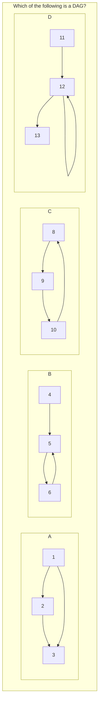

# Warehousing ETL - Basics: Directed Acylic Graph

## Item ID
2809

## Claim
2

## Target Skill Level
1

## Claim Behavior (evidence)
[Directed Acyclic Graph](https://en.wikipedia.org/wiki/Directed_acyclic_graph)

## Content Target
Scheduling and orchestration

## Cognitive Model
Recall

## Item Type
Multiple Choice

## Stem
In Apache Airflow or similar systems, a workflow with several tasks with dependencies between them is often expressed as a directed acyclic graph (DAG).

In the following diagram, which graph is a DAG?

![dag.png]

## Code Snippet (Optional)

## Answer Key
A

## Distractors
### 1
B

### 2
C

### 3
D

## Common errors, misconceptions, or irrelevant information (Optional)
B, C, and D all have cycles.

## Triplebyte Review
- Language Review:
- Bias/Fairness Review:
- Content Review:

## Markup to generate dag.png

